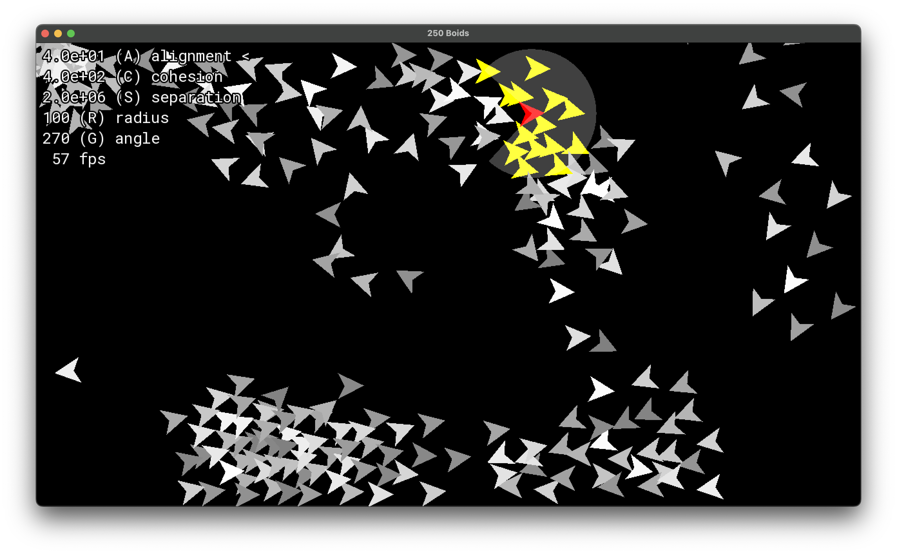

# boids

SFML-based flocking simulation program



# Requirements
 * C++17
 * CMake 3.16

# Building & Running

```
cmake -B build -DCMAKE_BUILD_TYPE=Release
cmake --build build
cmake --build build --target run
```

# Controls

| Action            | Control         |
| ----------------- | --------------- |
| Select boid       | Left click      |
| Select parameter  | A, C, S, R, G   |
| Change parameter  | Up, Down        |
| Reset             | Space           |
